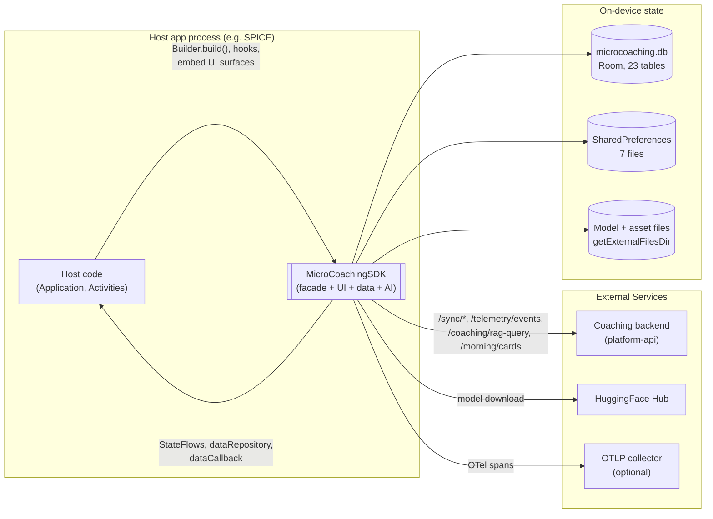
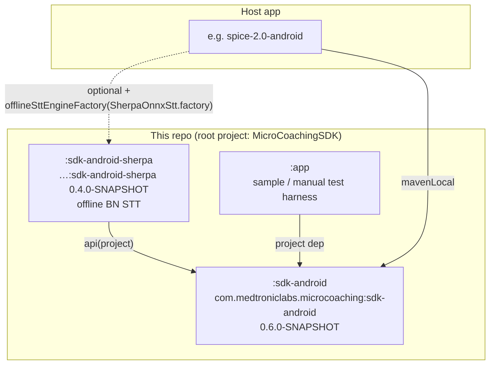
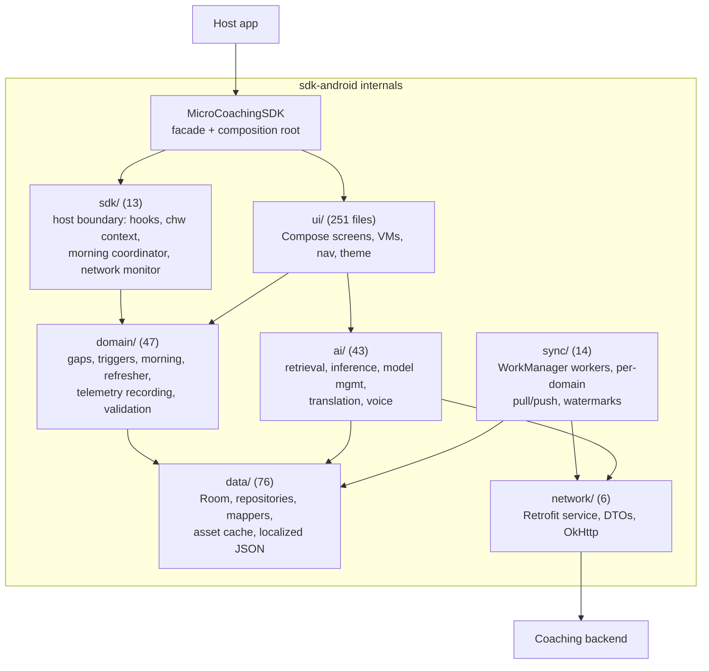
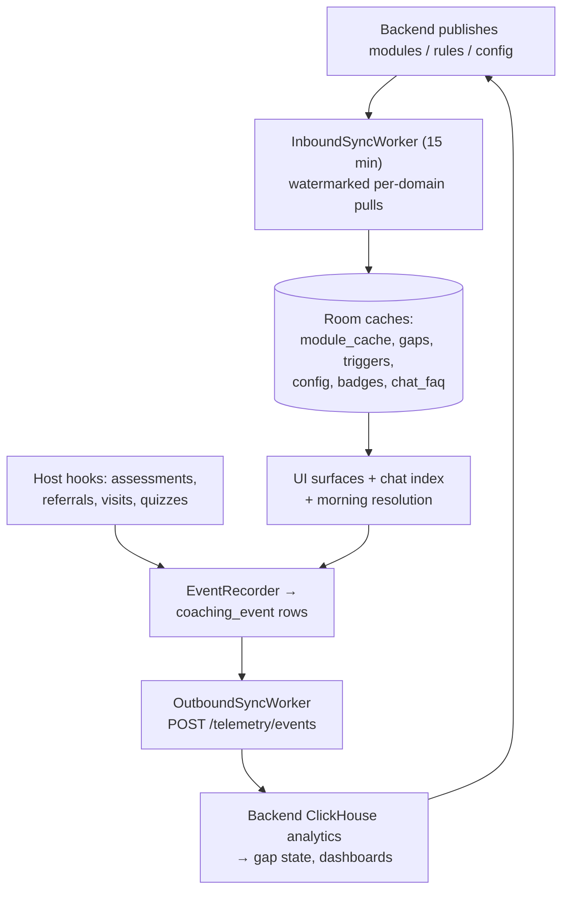
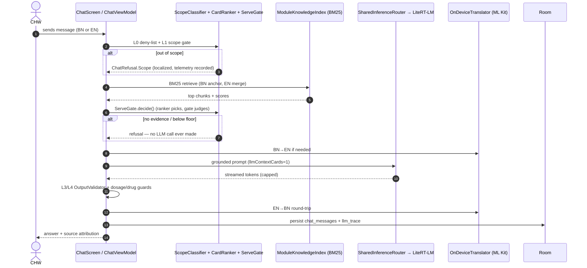
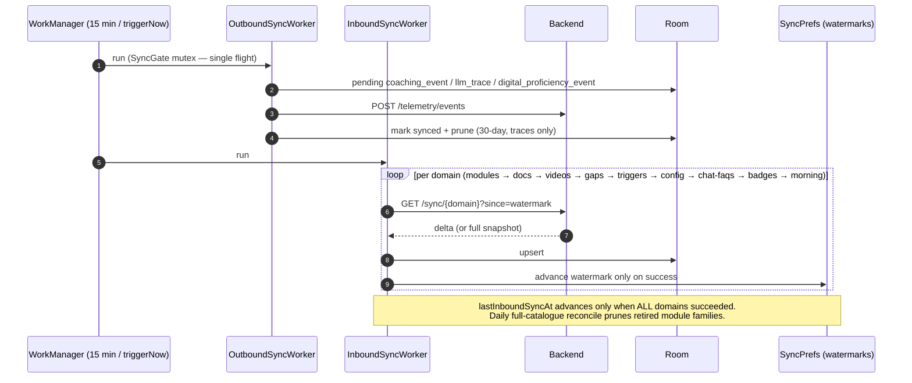
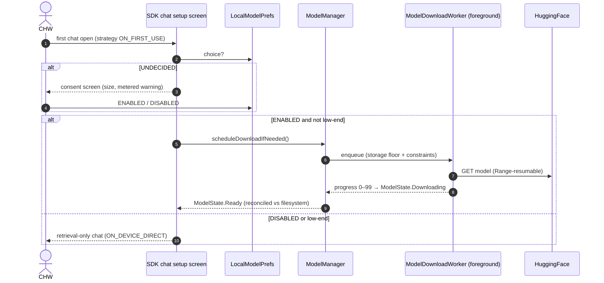
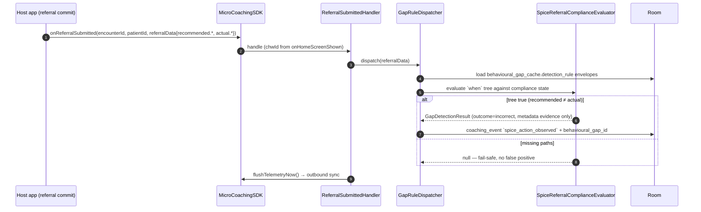
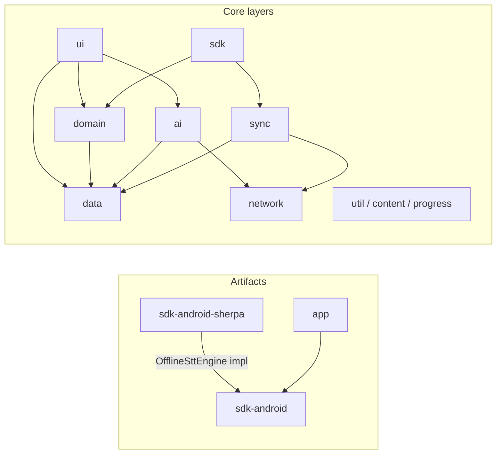

# MicroCoaching Android SDK — Architecture Document

> **Generated**: 2026-08-31
> **Version**: `sdk-android:0.6.0-SNAPSHOT` · `sdk-android-sherpa:0.4.0-SNAPSHOT`
> **Disclaimer**: Generated using AI and lightly edited/reviewed.

---

## Table of Contents

1. [Executive Summary](#1-executive-summary)
2. [System Context](#2-system-context)
3. [Technology Stack](#3-technology-stack)
4. [Module / Artifact Architecture](#4-module--artifact-architecture)
5. [Component Architecture](#5-component-architecture)
6. [Data Architecture](#6-data-architecture)
7. [Key Workflows](#7-key-workflows)
8. [Build, Publishing & Consumption](#8-build-publishing--consumption)
9. [Architectural Decisions](#9-architectural-decisions)
10. [Cross-Cutting Concerns](#10-cross-cutting-concerns)
- [Appendix A — Dependency Graph](#appendix-a--dependency-graph)
- [Appendix B — Annotated File Structure](#appendix-b--annotated-file-structure)
- [Appendix C — In Progress / Known Gaps](#appendix-c--in-progress--known-gaps)

**Related docs (not duplicated here):**

| Doc | Purpose |
|-----|---------|
| [`documentation/00-quick-start.md`](documentation/00-quick-start.md) | Host-app integration, end to end in one file |
| [`documentation/README.md`](documentation/README.md) | Integration guide index + public API quick reference |
| [`references/chat.md`](references/chat.md) | Chat pipeline behaviour deep-dive (L0–L5, retrieval, guardrails) |
| [`gaps/GAP_DETECTION_SDK.md`](gaps/GAP_DETECTION_SDK.md) | Gap-detection rule model and evaluator contract |
| [`documentation/07-theming.md`](documentation/07-theming.md) | Host theming tokens and traps |
| [`ios-port-assessment.md`](ios-port-assessment.md) | Feasibility notes for an iOS port |

---

## 1. Executive Summary

MicroCoaching is a **Kotlin Android library** (`.aar`) that embeds offline-first AI coaching for Community Health Workers inside a host clinical app (SPICE). It ships chat over an **on-device LLM** (LiteRT-LM, downloaded at runtime with user consent), a micro-learning flow (modules → cards → quizzes), morning coaching cards, badges, a Program-Officer dashboard, and coaching telemetry — all behind a single DI-free singleton facade (`MicroCoachingSDK`) the host builds once in `Application.onCreate()`.

The SDK owns its own Room database, WorkManager sync, and OpenTelemetry pipeline, fully isolated from the host's. Content (modules, gap rules, triggers, config, badges) syncs down from the coaching backend on a 15-minute cadence with per-domain watermarks; coaching events sync up. Every product surface is designed to keep working with the backend unreachable: retrieval-only chat, an on-device replica of the morning-cards decision, and an asset cache.

**At a glance:**

| Attribute | Value |
|-----------|-------|
| Primary language | Kotlin 2.1.20 (Java 11 target) |
| UI | Jetpack Compose (BOM 2025.04.01), consumable from XML/Fragment hosts |
| Architecture style | Single facade + manual composition root; layered packages (ui / domain / data / ai / sync / sdk / network) |
| Deliverables | `sdk-android` (required `.aar`), `sdk-android-sherpa` (optional offline Bengali STT), `app` (sample, not shipped) |
| Data stores | Room (`microcoaching.db`, schema v35, 23 tables), 7 SharedPreferences files (no DataStore) |
| Background work | WorkManager: inbound/outbound sync (15 min), model download (foreground service), STT pack download |
| On-device AI | LiteRT-LM engine + BM25 retrieval + ML Kit EN↔BN translation; default model Qwen3-0.6B mixed-INT4 (~497 MB, ungated) |
| External dependencies | Coaching backend (sync, RAG, morning cards, dashboards), HuggingFace (model download), OTLP collector (optional telemetry) |
| DI | None, deliberately — the SDK never forces a framework on its host |
| ABI / floor | `arm64-v8a` only · `minSdk 23` · `compileSdk 36` |

---

## 2. System Context

The SDK is a **guest inside the host app's process**. The host builds the singleton, forwards workflow events (hooks), and mounts SDK UI surfaces; the SDK talks to the coaching backend, HuggingFace, and an optional OTLP collector on its own OkHttp stack, and persists everything in its own Room database — it never touches the host's storage or network layer.



### External Dependencies

| System | Used by | Purpose | Connection |
|--------|---------|---------|------------|
| **Coaching backend** | sync workers, chat (online mode), morning resolver, PO dashboard | Content catalogue pull, telemetry push, server-side RAG, morning cards, dashboards | Retrofit/OkHttp; `Authorization: <authToken>` verbatim + `X-Tenant-Id` + `X-SDK-Version` |
| **HuggingFace Hub** | `ModelDownloadWorker`, `SttModelDownloadWorker` | LLM + STT model bytes at runtime | HTTPS with `Range` resume; token only for gated repos |
| **OTLP collector** | `TelemetryManager` | Span export (SigNoz/Tempo/Jaeger/any) | OTLP/HTTP, host-configured endpoint + headers |

### Users & Clients

| Actor | Touches | Purpose |
|-------|---------|---------|
| **Host app code** | `MicroCoachingSDK.Builder`, hooks (`onHomeScreenShown`, `onAssessmentSubmitted`, `onReferralSubmitted`, …), public StateFlows | Init/config, workflow event forwarding, reactive home-screen state |
| **CHW (SK persona)** | `CoachingChatBottomSheet`, `CoachingFlowActivity`, `CoachingGridTile`, `ChatFab` | Chat, learn modules, quizzes, refreshers, badges |
| **Program Officer (PO persona)** | `CoachingHomeHost` PO branch | Team dashboard, drilldowns (no refreshers — `PersonaPolicy`) |
| **Host backend forwarding (optional)** | `CoachingDataRepository` (pull) / `MicroCoachingDataCallback` (push) | Read chat history / relay coaching events through the host's own pipe |

---

## 3. Technology Stack

| Category | Technology | Version / notes | Purpose | Rationale |
|----------|------------|-----------------|---------|-----------|
| Language | Kotlin | 2.1.20, Java 11 target | Entire SDK | Android standard; coroutines-first |
| Build | AGP + KSP | 9.1.0 / 2.1.20-1.0.32 | Library build, Room codegen | `android.disallowKotlinSourceSets=false` needed for KSP+Room under AGP 9 |
| UI | Jetpack Compose | BOM 2025.04.01, Material3 | All screens; `ComposeView`/Fragment wrappers for XML hosts | Host needs no Compose migration |
| Persistence | Room | 2.7.0 (KSP) | `microcoaching.db`, schema v35, 21 hand-written migrations | Offline-first system of record on device |
| Background | WorkManager | 2.10.1 | Periodic sync, model/STT download (foreground `dataSync` service) | Survives process death; resumable |
| Networking | OkHttp + Retrofit | 4.12.0 / 2.11.0 | Backend API + downloads | SDK-owned client; token read per request (`@Volatile`) |
| Serialization | kotlinx-serialization-json | 1.8.1 | DTOs, JSON-blob columns, rule envelopes | Tolerant (`LenientJson`) + strict instances in `util/MicroCoachingJson` |
| LLM engine | LiteRT-LM | `com.google.ai.edge.litertlm:litertlm-android:0.16.1` | On-device generation (`.litertlm` bundles) | Only bundled engine; MediaPipe `.task` no longer shipped |
| Retrieval | Pure-Kotlin BM25 | in-repo (`ai/retrieval`) | Field-weighted Okapi BM25, EN+BN | No native deps; deterministic and testable |
| Translation | ML Kit Translate | 17.0.3 | EN↔BN round-trip (~20 MB pack, on demand) | On-device; needed both for the LLM and the bn-only backend |
| Voice | Platform `SpeechRecognizer` + sherpa-onnx 1.13.2 (sidecar) | — | EN/BN online STT; offline BN STT via `:sdk-android-sherpa` | Sherpa isolated in an optional artifact (~30 MB) |
| Telemetry | OpenTelemetry | 1.48.0 (api/sdk/OTLP+logging exporters) | Spans + counters, host-configured | Vendor-neutral; noop when disabled |
| Media | Media3/ExoPlayer 1.4.1, Coil 2.7.0, platform `PdfRenderer` | — | Training videos, cached images, PDF preview | pdfium-based viewer dropped (−7.7 MB/ABI native) |
| Publishing | maven-publish | `com.medtroniclabs.microcoaching` | `.aar` + sources jar to Maven Local (remote pending) | Standard Gradle consumption |

---

## 4. Module / Artifact Architecture

Three Gradle modules; only the first two publish.



### 4.1 — `:sdk-android` (the library)

- **Purpose**: everything — facade, UI, data, AI, sync, telemetry. 462 main-source files, 110 unit-test files.
- **Boundary**: hosts consume only the public facade surface (§5.1); ~120 declarations are `internal`.
- **Manifest merge**: the SDK's own manifest contributes all permissions (`INTERNET`, `RECORD_AUDIO`, `POST_NOTIFICATIONS`, foreground-service types, …), a `<queries>` entry for speech recognition, the WorkManager `dataSync` service patch, three non-exported activities, and a `FileProvider`. **Hosts make zero manifest changes.**
- **ProGuard**: `consumer-rules.pro` ships in the `.aar` (the library itself is not minified, so `proguard-rules.pro` never runs).

### 4.2 — `:sdk-android-sherpa` (optional sidecar)

- **Purpose**: offline Bengali speech-to-text via sherpa-onnx, kept out of the core artifact (~30 MB of native libs).
- **Isolation trick**: `:sdk-android` defines only the `OfflineSttEngine` tag interface; the sidecar exposes `SherpaOnnxStt.factory: (Context, File) -> OfflineSttEngine` which hosts pass to `Builder.offlineSttEngineFactory(...)`. Core never links sherpa classes.
- **Build quirk**: custom tasks download the sherpa-onnx AAR from the k2-fsa GitHub release and **explode it** into a classes jar + `jniLibs` (AGP refuses `implementation(files("*.aar"))` from a library module).

### 4.3 — `:app` (sample)

Not shipped. `SampleApplication` shows the canonical init (including the `PROVIDED`-if-exact-file-present probe), `MainActivity` fakes a SPICE-like home screen (tile grid, drawer, coaching card, `ComposeView` interop), `ChatTestActivity` is a minimal chat harness. Dev secrets come from `local.properties` → `BuildConfig` (`HF_TOKEN`, `OTEL_ENDPOINT`, …).

---

## 5. Component Architecture

### 5.1 — The facade and composition root

`MicroCoachingSDK` (1,503 lines) is a `@Volatile` singleton constructed only by its `Builder`. `build()` **replaces** the instance: it shuts down the outgoing one first (deliberate — the new `init{}` schedules periodic sync under the same unique work names the old `shutdown()` cancels; the reverse order would cancel the fresh sync). `MicroCoachingConfig` has an `internal` constructor — the Builder is the only path.

Because the SDK is **DI-free by policy**, the facade is a hand-ordered composition root with a documented eager/lazy split:

- **Eager** (leaf → dependent): `database` first ("a null-delegate NPE becomes structurally impossible"), then `triggerEvaluator`, `onDeviceMorningGenerator`, `gapRuleDispatcher`, `visitCompletedHandler`, `networkMonitor`, `chwContextStore`, `morningCoordinator`, ….
- **Lazy with explicit `Lazy` handles** so `shutdown()` releases only what was actually created: `telemetry`, `modelManager`, `sttModelManager`, `translator`, `okHttpClient`.
- **Provider lambdas** (`{ chwPrefs }`, `{ database.moduleDao() }`) passed to collaborators so constructing one never forces another lazy — the file calls this "the facade's init-order landmine".

`init{}` does exactly four things: (1) when `backendUrl` is non-blank — destructive-migration watermark reset check, `syncCoordinator.schedulePeriodic()`, `networkMonitor.register()`; (2) warm the EN↔BN translation pack; (3) *nothing else eager* — the chat BM25 index defers to first chat open; (4) a throttled `coaching_event`-count collector that re-filters morning modules on new events.

**Threading**: one `sdkScope = SupervisorJob() + Dispatchers.IO + CoroutineExceptionHandler`. The handler is load-bearing: an uncaught exception in SDK background work must never take the host app down — "an SDK is a guest in the host process."

**Cheap updates instead of rebuilds**: `updateAuthToken(token)` (one volatile write, read per-request by the interceptor), `setLanguage(...)`, `setPersona(...)`.

**Public surface** (everything else is `internal`):

| Group | Members |
|---|---|
| Facade + config | `MicroCoachingSDK`/`Builder`, `MicroCoachingConfig`, `SdkHealthReport`, enums (`Language`, `CoachingPersona`, `ModelDownloadStrategy`, `ChatScopeStrictness`), tuning (`ChatTuning`, `ServeTuning`, `RefresherTuning`) |
| Hooks | `onHomeScreenShown` (**sets `currentCHWId` — every other hook no-ops without it**), `onAssessmentSubmitted`, `onReferralSubmitted`, `onVisitCompleted`, `onFormSubmitted`, `onRuleFired`, `onRiskFlagObserved`, `onEquipmentAnomaly`, `onMorningOpen`, quiz/cards completion, CHW context, today's visits, connectivity/flush/logout |
| UI surfaces | `CoachingChatFragment` / `CoachingChatBottomSheet` / `CoachingChatSurface`, `CoachingFlowActivity`, `CoachingGridTile`, `ChatFab`/`DraggableChatFab`, `CoachingFabView`, `MorningCard`/`LearnCard`, `MicroCoachingTheme` |
| Reactive state | `morningModules`, `selectedMorningModule`, `networkAvailable`, `syncStatus`, `translationModelState`, `learningPoints`, badge/video indicators, … |
| Data boundary | `dataRepository: CoachingDataRepository` (pull), `Builder.dataCallback(MicroCoachingDataCallback)` (push) |
| Services | `modelManager`, `sttModelManager`, `localModelPrefs`, `syncCoordinator`, `telemetry`, `translator`, `assetCache`, `apiService` |

### 5.2 — Layer map



### 5.3 — Chat / AI pipeline

Chat routes on **`AnswerMode`** (`domain/decision/AnswerModeResolver.kt`), a pure ladder over `(preferOnline, networkAvailable, deviceEligible, consent, modelReady, engineLoaded)`:

| Mode | Path | Needs |
|---|---|---|
| `ONLINE` | `ChatBackendAnswerer` → `POST /coaching/rag-query` (backend retrieval + generation) | Network |
| `ON_DEVICE_ASSISTED` | `ChatLocalAnswerer` full L0→L5: deny-list → scope gate → BM25 + dense → fusion → ranker → `ServeGate` → LLM → groundedness and validators → BN↔EN round-trip | Downloaded model + consent |
| `ON_DEVICE_DIRECT` | Same retrieval + gate, serving clinician-authored card text verbatim | Nothing but the local index — the hard floor |

Key invariant: **`ServeGate` (`ai/retrieval/ServeGate.kt`) is the single serve/refuse authority for both offline paths, and it runs *before* any LLM call.** `CardRanker` picks one card from the fused candidates; the gate serves or refuses that card and never substitutes another. It demands shared clinical evidence (`CardEvidence`: condition terms + synonym concepts), applies per-language score floors (`ServeTuning`), and refuses with `NO_HITS` / `NO_EVIDENCE` / `BELOW_SCORE_FLOOR`. After the model, a rejected answer is replaced by the same card verbatim; nothing after the gate refuses it. The model can only reword a card the gate already served — "this mode gives up presentation, not accuracy."

Supporting pieces: `ModuleKnowledgeIndex` (field-weighted BM25 over TITLE/BODY/QUESTION/KEYWORD × EN/BN, one chunk per card, built lazily on first chat open, excludes retired families), `ScopeClassifier` (clinical allow-list + deny terms; `Strict` vs `ExtendedClinical`), `InferenceRouter`/`SharedInferenceRouter` (ref-counted — two routers on one mapped model file is a native crash), `OnDeviceTranslator` (ML Kit, 8 s timeout then passthrough), `OutputValidator` + `ChatRefusal` (guardrails, localized refusal strings, every refusal recorded as telemetry).

Voice: `ChatVoiceInputController` picks per language/connectivity — EN → platform recognizer; BN online → platform; BN offline → sherpa engine if the host wired the factory and the STT pack is present.

### 5.4 — Model management

- `ModelCatalog`: compile-time allowlist of 4 variants; default `qwen3-0-6b-mixed-int4-litertlm` (~497 MB, apache-2.0, **ungated** — no HF token needed); gated Gemma variants kept as rollback.
- `ModelManager` (819 lines): state machine (`Idle/Downloading/Paused/Ready/DownloadFailed/Corrupt`) exposed as `StateFlow`, readiness persisted and reconciled against the filesystem at construction.
- `ModelDownloadWorker`: WorkManager **foreground service** (`dataSync` type), resumable via HTTP `Range`, provider fallback `Backend → HuggingFace → Kaggle` (Backend currently skipped — serves a format no bundled engine loads; Kaggle unimplemented).
- **Consent gating**: `LocalModelPrefs.choice` is tri-state (`UNDECIDED/ENABLED/DISABLED`) so a decline is distinguishable from a fresh install. The composite gate is `localModelEnabled = !isLowEndDevice && choice == ENABLED` — the SDK's chat setup screen owns the consent UX; hosts build no prompt.
- Low-end devices (< 3 GB RAM, `DeviceCapability`) never download a model and run retrieval-only chat.

### 5.5 — Hooks, gaps, triggers, morning

- `AssessmentSubmittedHandler` — fires at assessment save: workflow-signal evaluation and coaching-card resolution only (**no gap rules here**).
- `ReferralSubmittedHandler` — fires at referral commit, the only point where the CHW's actual destination exists; runs `spice_referral_compliance` rules via `GapRuleDispatcher` and emits one gap-tagged `spice_action_observed` per fired gap. `WrongFacilityTierEvaluator` is the one evaluator wired end-to-end; three others are skeletons.
- `TriggerEvaluator` — matches `workflow_event`/`gap` predicates from synced `trigger_definition` rows against events, yielding candidate modules.
- Morning surface — 4-tier resolution (`MorningModuleResolver`): `morning_card_cache` join → live `GET /morning/cards` → `OnDeviceMorningGenerator` (a full on-device replica of the server decision, so mornings work offline) → `TriggerEvaluator` rows → empty. `MorningSurfaceCoordinator` owns refresh/invalidations and the CHW-switch cache clear; `PersonaPolicy` enforces "PO has no refreshers".

---

## 6. Data Architecture

### 6.1 Data Stores

| Store | Type | Purpose | Access pattern |
|-------|------|---------|----------------|
| **Room `microcoaching.db`** | SQLite, schema **v35** | System of record on device: content catalogue, per-CHW state, outbound event queues, caches | DAOs internal; hosts go through `CoachingDataRepository` only |
| **SharedPreferences** (7 files, no DataStore) | Key-value | Sync watermarks (`micro_coaching_sync`), model consent + lifecycle (`microcoaching_model_prefs` — shared file so consent and file state can't disagree), CHW context, chat mode, onboarding/reminder | `util/PrefsNames.kt` is the registry (documents one deliberate file collision) |
| **Files** (`getExternalFilesDir`) | Blobs | LLM model bundle, STT pack, `AssetCache` media (images/videos/PDFs for offline render) | Downloaded on demand; storage floored at `minFreeStorageBytes` (512 MB default) |

**Migrations**: 21 hand-written (`MIGRATION_14_15`…`MIGRATION_34_35`) plus `fallbackToDestructiveMigration` as a safety net. The facade detects a destructive wipe (`SyncPrefs.lastKnownRoomVersion` vs the current schema version) and resets **watermarks only**, so the next inbound pull re-fetches the full snapshot.

### 6.2 Core Data Model

The **module** is the unit of meaning (mirroring the backend). `module_cache` holds one row per family's newest version with cards as a JSON blob; per-CHW learning state lives in dedicated tables; coaching events are an append-only outbound queue.

```mermaid
erDiagram
    MODULE_CACHE {
        text module_family_id PK
        int version
        text title_json
        text cards_json
        text search_metadata_json
        text source_documents_json
    }
    ASSIGNED_MODULE {
        text user_id
        text module_family_id
    }
    BEHAVIOURAL_GAP_CACHE {
        text behavioural_gap_id PK
        text detection_rule
    }
    CHW_GAP_PROFILE_LOCAL {
        text behavioural_gap_id PK
        text chw_id
        int occurrence_count
    }
    TRIGGER_DEFINITION {
        text id PK
        text trigger_type
        text predicate_json
    }
    MODULE_TRIGGER_BINDING {
        text trigger_id FK
        text module_family_id FK
    }
    CHW_MODULE_COMPLETION {
        text chw_id
        text module_family_id
        long completed_at
    }
    CHW_QUIZ_QUESTION_STATE {
        text chw_id
        text question_id
        bool correct
    }
    COACHING_EVENT {
        long id PK
        text event_type
        text chw_id
        text patient_id_hash
        bool synced
    }
    CHAT_MESSAGES {
        text id PK
        text session_id
        text role
        text content
        text source_documents_json
    }
    MORNING_CARD_CACHE {
        text module_family_id PK
        text source
        text behavioural_gap_id
    }
    BADGE {
        text badge_id PK
        text chw_id
        long locally_earned_at
    }

    MODULE_CACHE ||--o{ ASSIGNED_MODULE : assigned
    MODULE_CACHE ||--o{ MODULE_TRIGGER_BINDING : bound
    TRIGGER_DEFINITION ||--o{ MODULE_TRIGGER_BINDING : triggers
    BEHAVIOURAL_GAP_CACHE ||--o{ CHW_GAP_PROFILE_LOCAL : tracked_for
    MODULE_CACHE ||--o{ CHW_MODULE_COMPLETION : completed
    MODULE_CACHE ||--o{ MORNING_CARD_CACHE : surfaces
    MODULE_CACHE ||--o{ CHW_QUIZ_QUESTION_STATE : quizzed
```



Full table inventory (23): content — `module_cache`, `assigned_module`, `requested_module`, `published_source_document`, `source_document_thumbnail`, `assigned_video`, `chat_faq`, `badge`, `trigger_definition`, `module_trigger_binding`, `behavioural_gap_cache`, `config_threshold`, `morning_card_cache`; per-CHW state — `chw_gap_profile_local`, `chw_module_completion`, `chw_module_partial_completion`, `chw_quiz_question_state`, `dashboard_cache`; outbound queues — `coaching_event`, `llm_trace`, `digital_proficiency_event` (the latter two pruned after 30 days once synced); chat — `chat_messages`; infra — `cached_asset`.

Localization convention: bilingual columns store `{"bn": …, "en": …}` JSON blobs read through `data/localized/LocalizedText.kt`.

### 6.3 Data Flow

Primary loop: **backend catalogue → device state → coaching events → backend analytics**.



---

## 7. Key Workflows

### 7.1 — Offline chat answer (ON_DEVICE_ASSISTED)



`ON_DEVICE_DIRECT` is the same flow minus steps 7–10: the gated card's clinician-authored text is served verbatim.

### 7.2 — Sync cycle



Blank `backendUrl` short-circuits everything. Outbound retries while `currentCHWId` is null (backend rejects non-numeric ids). Retry policy is per-error-kind: NETWORK/HTTP_SERVER retry; HTTP_CLIENT/UNEXPECTED fail to the next tick.

### 7.3 — Model download (consent-gated)



### 7.4 — Referral submitted → gap fired



---

## 8. Build, Publishing & Consumption

| Command | Purpose |
|---|---|
| `./gradlew :sdk-android:assembleRelease` | Build the `.aar` |
| `./gradlew :sdk-android:test` | Unit tests (110 files; JVM, no device) |
| `./gradlew :sdk-android:publishToMavenLocal` | Publish `com.medtroniclabs.microcoaching:sdk-android:0.6.0-SNAPSHOT` (+ sources jar) to `~/.m2` |
| `./gradlew :sdk-android-sherpa:publishToMavenLocal` | Publish the optional STT sidecar (`0.4.0-SNAPSHOT`) |
| `./gradlew :sdk-android:retrievalLab` | Dev-only local retrieval server (`127.0.0.1:7171`) over the audit corpus for BM25/serve-gate tuning |

- Versions live in each module's `build.gradle.kts` publishing block; `BuildConfig.SDK_VERSION` is injected from the same value and stamped on telemetry (`service.version`) and the `X-SDK-Version` header.
- Consumption today is **Maven Local only** (host adds `mavenLocal()` first); no remote repository is configured yet. Host wiring, required build-file additions, and ProGuard specifics: [00 — Quick Start](documentation/00-quick-start.md) and [01 — Setup](documentation/01-setup.md).
- CI colour-token guard: `scripts/check-no-hardcoded-colors.sh` fails the build on raw `Color(0xFF…)` outside the theme package.

---

## 9. Architectural Decisions

### 9.1 — DI-free SDK, manual composition root

**Status**: Accepted (recorded in `sdk-android/build.gradle.kts`)
**Context**: The SDK is embedded into host apps with their own (or no) DI frameworks.
**Decision**: No Hilt/Koin anywhere in the library; `MicroCoachingSDK` hand-constructs the object graph; `ChatViewModel` uses a manual factory.
**Trade-offs**:
- ✅ Zero constraints on host architecture; trivially embeddable
- ✅ The whole graph is readable in one file
- ⚠️ Init-order hazards are managed by convention (eager/lazy split, provider lambdas) rather than a container
- ⚠️ The facade is large (1,500 lines) and grows with every subsystem

### 9.2 — Singleton with replace-on-rebuild + cheap update escape hatches

**Status**: Accepted
**Context**: Hosts need to change the auth token (login), language, and persona after init.
**Decision**: `build()` replaces the singleton (shutdown-before-construct, ordered around WorkManager unique names); `updateAuthToken` / `setLanguage` / `setPersona` avoid rebuilds for the common cases.
**Trade-offs**:
- ✅ Immutable config; no partially-updated states
- ⚠️ A rebuild silently resets every omitted Builder option — the documented "theme reverts after login" trap; hosts should prefer `updateAuthToken`

### 9.3 — Offline-first everywhere, with a no-model chat floor

**Status**: Accepted
**Context**: CHWs work in low-connectivity field conditions on low-RAM devices.
**Decision**: Room-first reads with non-fatal per-domain sync; an on-device replica of the morning-cards decision; `ON_DEVICE_DIRECT` chat that serves clinician-authored card text via BM25 with no network and no model; `AssetCache` for media.
**Trade-offs**:
- ✅ Every surface renders offline; graceful per-domain degradation
- ⚠️ Duplicated decision logic (server + `OnDeviceMorningGenerator`) must be kept in behavioural sync
- ⚠️ Eventual consistency: gap state converges only after telemetry round-trips

### 9.4 — One serve/refuse gate (`ServeGate`, formerly `ServeDecision`)

**Status**: Accepted (commit `64b6b24`)
**Context**: An on-device LLM answering ungrounded clinical questions is a safety risk.
**Decision**: One pure gate, shared by both offline paths, runs **before** any LLM call; it requires demonstrable shared clinical evidence and refuses otherwise. The LLM can only reword a card the gate already served. Choosing the card is a separate step (`CardRanker`) that runs first, so the gate only serves or refuses one card, and every stage logs one trace line (`FUSED`, `RANK`, `GATE`, `POST`).
**Trade-offs**:
- ✅ No hallucinated clinical answers offline; refusals are deterministic and testable (`retrievalLab`)
- ⚠️ Conservative: in-scope questions with weak lexical overlap get refused (semantic retrieval is the planned fix — Appendix C)

### 9.5 — Runtime model download, consent-gated, allowlisted

**Status**: Accepted
**Context**: Model bundles are ~0.5 GB; bundling is impossible and downloads cost users real data.
**Decision**: Models never ship in the `.aar`. A compile-time `ModelCatalog` allowlist (default: ungated Qwen3-0.6B) is downloaded by a resumable foreground worker, only after explicit tri-state user consent (`UNDECIDED/ENABLED/DISABLED`), never on low-end devices. The SDK owns the consent UX.
**Trade-offs**:
- ✅ Small artifact; informed consent; deterministic model provenance
- ⚠️ First-use latency; hosts can no longer force-download without consent

### 9.6 — Sherpa STT as an exploded-AAR sidecar artifact

**Status**: Accepted
**Context**: Offline Bengali STT needs sherpa-onnx (~30 MB native), which most hosts don't want.
**Decision**: Separate `:sdk-android-sherpa` artifact; the core defines only a factory-injected `OfflineSttEngine` interface; the sidecar's build downloads and explodes the upstream AAR (AGP limitation).
**Trade-offs**:
- ✅ Core stays lean; opt-in is one dependency + one Builder line
- ⚠️ Unconventional build (network at build time, pinned upstream release)

### 9.7 — Light-only theming via a token object, not Compose theme wrapping

**Status**: Accepted (theming commit series, `cd8f529` etc.)
**Context**: The SDK owns its own Compose roots (activity + bottom sheets), so host `MaterialTheme` wrapping cannot work (M3 replaces rather than inherits).
**Decision**: `Builder.theme(CoachingColors)` — 35 tokens; 18 project onto M3 roles via `toM3Scheme()`, 17 read as `CoachingTheme.colors.*`; derived surfaces (chat bubbles, gradients) blend from `primary`. Dark mode unsupported; `uiTheme` deprecated and never read.
**Trade-offs**:
- ✅ Hosts restyle with one `copy()` off `CoachingColors.Spice`; existing M3 call sites untouched
- ⚠️ Init-time only; no runtime theme switching; no dark mode

---

## 10. Cross-Cutting Concerns

### Privacy

- Raw patient IDs never leave the device: `PatientIdHasher` stores **SHA-256** hashes on event rows; spans carry no prompt text, response text, or patient data (hashed session IDs only).
- `TodaysVisit`, `CHWWorkContext`, and `RecentPatientSummary` are deliberately PII-free shapes — clinical-type signal only, no names/phones.
- Quasi-identifiers are short-hashed (`sha256Short`) before any logcat line.

### Error containment & threading

- One `sdkScope` (`SupervisorJob + Dispatchers.IO`) with a swallowing `CoroutineExceptionHandler` — SDK background failures must never crash the host.
- Every host hook is guarded (`isInitialized()`, `runCatching` around event recording); all hooks no-op safely when data is missing.
- Sync failures are per-domain and non-fatal; `SyncStatusStore` is in-memory by design (cold start shows *Unknown*, never a resurrected stale failure).
- `SyncGate` mutexes enforce single-flight sync (added after real field OOMs from concurrent full-catalogue loads).

### Localization

- `SdkLocaleHelper.wrap(context, language)` injects `bn-BD`/`en-US` as `LocalContext` at every Compose root before theming, so `stringResource()` resolves from `res/values-bn/` regardless of device locale; digits localize separately.
- Bilingual content columns are `{"bn","en"}` JSON blobs read via `LocalizedText`; `setLanguage()` applies to LLM prompts immediately and UI on next screen open.

### Observability

- OTel spans (`chat.session`, `llm.inference.stream`, `llm.model.load`) + counters, exported OTLP/HTTP with host-configured endpoint/headers/sampling; `OpenTelemetry.noop()` when disabled.
- Row-based product telemetry (`EventRecorder` → `coaching_event`) is a separate channel from spans, using the backend's exact rollup keys.
- `checkHealth(): SdkHealthReport` for startup logging; `adb logcat -s MicroCoachingSDK ModelManager` for field debugging.

### Configuration

- All host configuration flows through the Builder into an immutable `MicroCoachingConfig` (internal constructor).
- Server-tunable behaviour (quiz thresholds, XP weights, morning limits) arrives via the `config_threshold` sync resource, with `MicroCoachingConfig` values as fallbacks — six threshold fields have **no Builder setters** on purpose.
- Four `enable*` feature flags (`Chat`/`LearnModule`/`ApplyModule`/`MeasureModule`) are reserved and currently unread; `enableVoice` is functional.

---

## Appendix A — Dependency Graph

Allowed boundaries between modules and layers:



**Forbidden / enforced by design**: `:sdk-android` → sherpa classes (factory injection only); hosts → DAOs (only `CoachingDataRepository` / `MicroCoachingDataCallback`); host `MaterialTheme` → SDK screens (init-time tokens only); secrets → the `.aar` (the HF token is host-supplied at runtime, never baked in); raw patient IDs → any span, log line, or backend payload.

---

## Appendix B — Annotated File Structure

```
spice-coaching-android/
├── settings.gradle.kts               # :sdk-android, :sdk-android-sherpa, :app
├── build.gradle.kts                  # root plugins
├── gradle/libs.versions.toml         # version catalog (AGP 9.1.0, Kotlin 2.1.20, …)
├── scripts/check-no-hardcoded-colors.sh   # CI theming guard
│
├── sdk-android/                      # THE library (.aar) — 462 main / 110 test files
│   ├── build.gradle.kts              # publishing (0.6.0-SNAPSHOT), retrievalLab task
│   ├── consumer-rules.pro            # ships in the .aar (library is not minified)
│   ├── src/main/AndroidManifest.xml  # all permissions/activities/provider merge from here
│   └── src/main/java/com/medtroniclabs/microcoaching/
│       ├── MicroCoachingSDK.kt       # facade, Builder, composition root, hooks (1503 L)
│       ├── MicroCoachingConfig.kt    # immutable config + tuning + public enums
│       ├── MicroCoachingInitializer.kt  # androidx.startup (deliberate no-op)
│       ├── ai/
│       │   ├── inference/            # LLMService, LiteRtLmService, (Shared)InferenceRouter
│       │   ├── model/                # ModelManager, ModelCatalog, download worker, consent prefs
│       │   ├── download/             # ResumableHttpDownloader (Range)
│       │   ├── retrieval/            # BM25 index, CardEvidence, CardRanker, ServeGate, ScopeClassifier, tokenizers
│       │   ├── translation/          # ML Kit EN↔BN
│       │   └── voice/                # controllers, platform engine, STT pack manager
│       ├── content/richtext/         # TipTap model/parser (shared by index + UI)
│       ├── data/
│       │   ├── db/                   # MicroCoachingDatabase (v35), entity/ (23), dao/ (22), migration/ (21)
│       │   ├── repository/           # chat, events, modules, gap profile
│       │   ├── asset/                # AssetCache (offline media)
│       │   └── localized/            # {"bn","en"} blob readers
│       ├── domain/
│       │   ├── gaps/                 # GapRuleDispatcher, evaluators, ondevice/ morning+quiz engines
│       │   ├── triggers/             # TriggerEvaluator, WorkflowPredicate
│       │   ├── decision/             # AnswerModeResolver, ModeSelector
│       │   ├── morning/ refresher/   # 4-tier morning resolution, CoachingModuleStore
│       │   ├── telemetry/            # TelemetryManager (OTel), EventRecorder, PatientIdHasher
│       │   ├── context/              # CHWWorkContext, TodaysVisit, PatientSnapshot
│       │   └── validation/ system/   # OutputValidator, DeviceCapability
│       ├── network/                  # CoachingApiService, DTOs, OkHttp factory
│       ├── progress/                 # badge rules, completion builder
│       ├── sdk/                      # HOST BOUNDARY: data repo + callback, hooks/,
│       │                             #   chw context, morning coordinator, network monitor
│       ├── sync/                     # SyncCoordinator, In/OutboundSyncWorker, per-domain APIs,
│       │                             #   SyncPrefs (watermarks), SyncGate, status store
│       ├── ui/                       # 251 files: chat/, learn/, flow/, coaching/, podashboard/,
│       │                             #   leaderboard/, badges/, theme/, components/, markdown/, …
│       └── util/                     # Json instances, PrefsNames registry, sanitizer
│
├── sdk-android-sherpa/               # optional offline BN STT (0.4.0-SNAPSHOT)
│   ├── build.gradle.kts              # downloads + explodes sherpa-onnx AAR at build time
│   └── src/main/…/sherpa/            # SherpaOnnxStt.factory, SherpaBengaliEngine
│
├── app/                              # sample app (not shipped)
│   └── src/main/…/sample/            # SampleApplication, MainActivity, ChatTestActivity
│
└── docs/
    ├── ARCHITECTURE.md               # this file
    ├── documentation/                # integration guide (00-quick-start … 07-theming)
    ├── references/                   # behaviour deep-dives (chat.md, …)
    └── gaps/                         # gap-detection specs + test plans
```

---

## Appendix C — In Progress / Known Gaps

- **Local embeddings for offline chat** *(shared roadmap with the backend — see the platform ARCHITECTURE.md)*: module publish will additionally produce embeddings from a locally-runnable embedding model, shipped to the device so offline retrieval gains semantic search alongside BM25. Generation stays as-is; only the retrieval layer is enhanced. This directly addresses the serve gate's main weakness (lexical-overlap dependence).
- **Stub / placeholder code** (kept deliberately, flagged honestly): `sdk/hooks/HookEvents.kt` and `sdk/hooks/SpiceHookAdapter.kt` (comment-only Phase-E placeholders); `ai/voice/BanglaSttEngine.kt` (TODO stub — real impl is the sherpa sidecar); `ModelProvider.Kaggle` (unimplemented, skipped); `ModelRuntime.MEDIAPIPE`/`LLAMA_CPP` (non-runnable, exist so stored values compile); three of four `GapEvaluator`s return null (only `WrongFacilityTierEvaluator` is wired end-to-end); `ModelManager.verifyIntegrity()` has no callers; `MicroCoachingInitializer.create()` is an empty body.
- **Reserved config**: `enableChat` / `enableLearnModule` / `enableApplyModule` / `enableMeasureModule` have zero read sites; `enableGapDetection` has no Builder setter (single read site in `ReferralSubmittedHandler`); a decision to either implement or deprecate them in code is pending.
- **Known defects**: `consumer-rules.pro` keeps `…chat.CoachingChatFragment` but the class lives in `…ui.chat` (release-minified hosts need a manual keep — see [01 — Setup](documentation/01-setup.md)); root `build.gradle.kts` still carries a stale `version = "0.2.0-SNAPSHOT"` (the publishing blocks in each module are authoritative); `PrefsNames` documents a deliberate ONBOARDING/REMINDER prefs-file collision pending a data migration.
- **iOS port**: assessed separately in [`ios-port-assessment.md`](ios-port-assessment.md).
