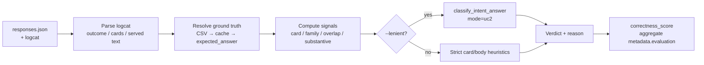
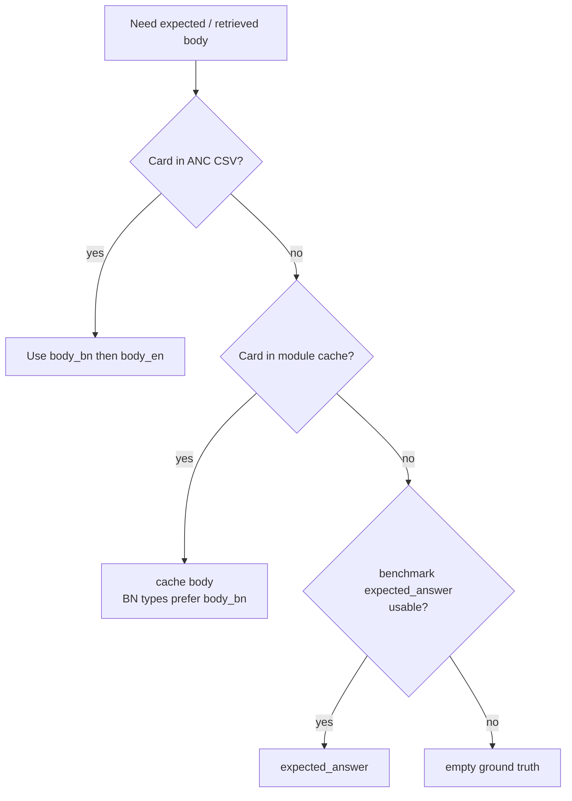
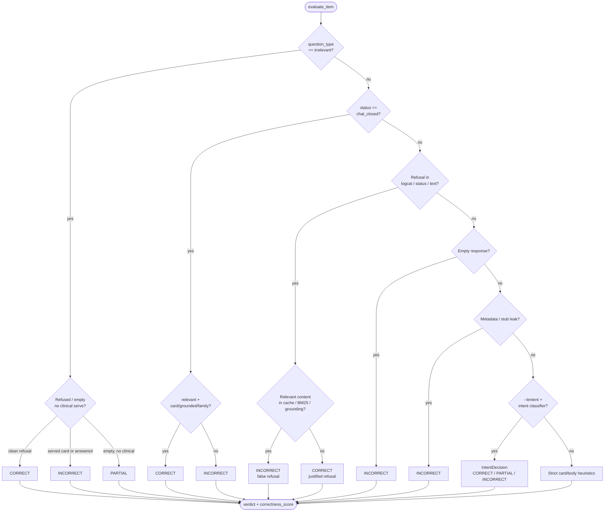
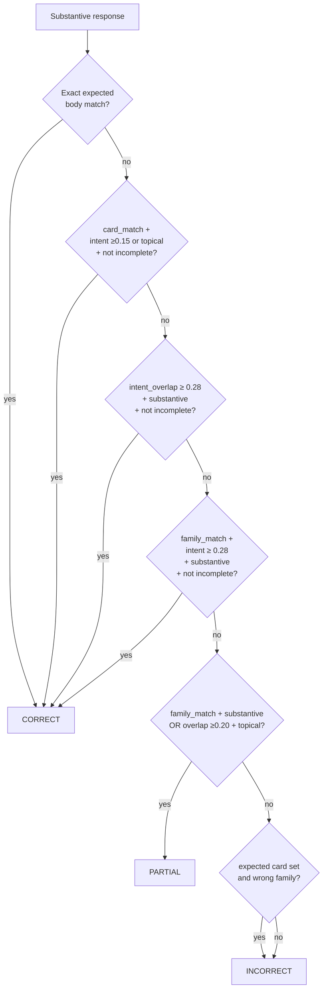
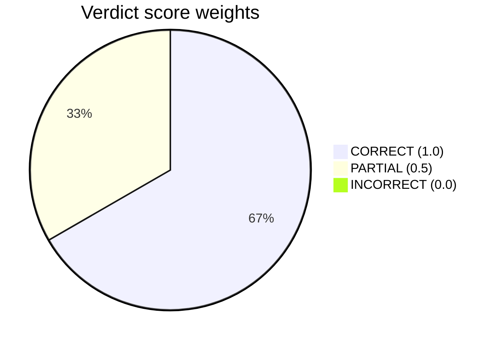

# UC2 correctness evaluation mechanism

**Use case:** UC2 — on-device assisted (`ON_DEVICE_ASSISTED`)  
**Pipeline:** BM25 (+ dense when available) → on-device LLM rewrites the selected card  
**Evaluator:** rule-based (no LLM judge)  
**Primary script:** [`scripts/evaluate_uc2_responses.py`](../scripts/evaluate_uc2_responses.py)  
**Shared intent rubric:** [`scripts/evaluate_lenient.py`](../scripts/evaluate_lenient.py)

Published standing summary: [`UC1_UC2_UC3_EVALUATION_SUMMARY.md`](UC1_UC2_UC3_EVALUATION_SUMMARY.md).

---

## How to run

```bash
python scripts/evaluate_uc2_responses.py path/to/responses.json --lenient --in-place
```

| Flag | Effect |
|------|--------|
| `--lenient` | Score against **published clinical intent** (canonical for standing reports) |
| *(omit)* | Stricter card/body heuristic path |
| `--in-place` | Write `evaluation` + `correctness` back into the responses JSON |
| `--cache-sql` | Module cache SQL for card bodies |
| `--anc-csv` | Optional ANC export CSV for card-body ground truth |

Recent UC2 standing runs use **`--lenient`**.

---

## What “correct” means for UC2

| Verdict | Meaning |
|---------|---------|
| **CORRECT** | Answer matches this question’s published clinical intent. Paraphrase OK. Exact card ID not required. |
| **PARTIAL** | Same module / near-miss, but weak Gemma rewrite or neighbor clinical intent. |
| **INCORRECT** | Stub/empty; wrong topic; false refusal when content exists; answered an off-topic question instead of refusing. |

**Weighted score:** `CORRECT + 0.5 × PARTIAL` (reported as % of N).

Per-item scores: CORRECT = `1.0`, PARTIAL = `0.5`, INCORRECT = `0.0`.

---

## End-to-end flow



---

## Inputs per question

| Input | Source |
|-------|--------|
| Question, `question_type` | Benchmark JSON |
| `expected_card_id`, `expected_module_family_id`, `expected_answer` | Benchmark |
| UI `response`, `status`, `retrieved_card_id` | Device capture |
| Logcat (`OUTCOME=…`, `groundedFrom`, `grounded=[…]`, BM25 hits, served text) | Per-question logcat |
| Module bodies | Module cache SQL and/or ANC CSV |

### Served text

Longest usable string among:

1. UI `response`
2. Fallback card body from logcat (`OUTCOME=FALLBACK` / body capture)
3. Text from `OUTCOME=served_grounded`

If logcat shows a refusal outcome, served text is treated as empty.

### Primary card ID

Resolved in order:

1. `retrieved_card_id` (capture field)
2. `groundedFrom` (logcat)
3. First entry in `grounded=[]`
4. BM25 top-1 (`native[0]…chunk=…`)

---

## Ground truth resolution



**Lenient ground-truth policy** (written into evaluation metadata):

> Published clinical intent vs published_modules content; exact card ID not required; same-module neighbor ≠ correct; refusal OK only when no relevant module content.

---

## Signals computed before the verdict

| Signal | Meaning |
|--------|---------|
| `card_match` | Expected card ID == primary served card |
| `grounded_expected` | Expected card appears in `groundedFrom` / `grounded[]` |
| `family_match` | Same module family (`{family}:card:N` prefix) |
| `text_match_expected` / `text_match_retrieved` | Near-verbatim body match (norm equality, containment, or high similarity) |
| `text_overlap_ratio` | Token / key-point overlap vs expected body |
| `substantive` | ≥40 chars; not stub, refusal, or metadata leak |
| `topical` | Shares significant tokens with the question |
| Intent metrics (lenient) | `intent_overlap`, `family_best_overlap`, `retrieved_overlap`, `incomplete_answer` |

### Metadata / stub leaks (always INCORRECT if served)

Phrases such as “skills that save lives”, “sop translation”, “flip-chart”, “job aid eng”, “brac sk”, plus short UI stubs.

### Intent thresholds (`evaluate_lenient.py`)

| Constant | Value | Role |
|----------|------:|------|
| `INTENT_CORRECT` | 0.28 | Minimum intent overlap for CORRECT (with other gates) |
| `INTENT_PARTIAL` | 0.12 | Near-miss / weak-alignment band |
| Incomplete | &lt;60 chars, or &lt;35% of a long expected body (unless overlap ≥0.50) | Blocks CORRECT; often yields PARTIAL |

---

## Verdict decision tree



### Lenient intent rules (UC2)



**UC2 intent summary:**

- **CORRECT** — exact expected body; or correct card with solid intent; or same family + intent overlap ≥0.28 + substantive + not incomplete.
- **PARTIAL** — right family retrieved but weak / incomplete rewrite; or substantive topical answer without clear intent credit.
- **INCORRECT** — wrong family / off-topic; empty / stub; false refusal; answered irrelevant question.

### Strict path (no `--lenient`)

Falls back to ordered heuristics: exact body + card/grounding → correct card with substantive rewrite → expected card only in grounding (PARTIAL) → wrong card but topical (PARTIAL) → wrong family (INCORRECT).

---

## Aggregation (`metadata.evaluation`)

Written into the responses file when using `--in-place`:

| Field | Meaning |
|-------|---------|
| `evaluation_mode` | `lenient` or `strict` |
| `correct` / `partial` / `incorrect` | Verdict counts |
| `correct_pct` | CORRECT / N |
| `weighted_score` / `weighted_pct` | `CORRECT + 0.5×PARTIAL` |
| `card_p1` / `card_p1_clinical` | Exact expected card as primary (clinical excludes `irrelevant`) |
| `grounded_expected_card*` | Expected card appeared in grounding |
| `by_question_type` | Per-type counts + weighted % |

Per response item:

```json
{
  "correctness": "CORRECT",
  "evaluation": {
    "verdict": "CORRECT",
    "correctness_score": 1.0,
    "reason": "…",
    "failure_reason": null,
    "card_match": false,
    "family_match": true,
    "relevant_answer": true,
    "intent_overlap": 1.0,
    "incomplete_answer": false
  }
}
```

---

## Scoring overview



Weighted percentage for a 100-question bank:

\[
\text{weighted\_pct} = 100 \times \frac{\text{CORRECT} + 0.5 \times \text{PARTIAL}}{N}
\]

Example from a recent BN run (`uc2_100_bn_20260923`, lenient): CORRECT 35, PARTIAL 46, INCORRECT 19 → **weighted 58.0%**.

---

## Question types

| Type | Typical expectation |
|------|---------------------|
| `exact_match` | Canonical phrasing; intent match still required in lenient mode |
| `paraphrased` / `code_mixed` / `typo_noisy` / `native_bengali` | Relaxed topical gates in strict path; same intent rubric in lenient |
| `irrelevant` | Must refuse (or serve nothing clinical) — answering is INCORRECT |

---

## Related files

| Path | Role |
|------|------|
| `scripts/evaluate_uc2_responses.py` | UC2 evaluator entry point |
| `scripts/evaluate_lenient.py` | Shared UC2/UC3 clinical-intent classifier |
| `scripts/evaluate_uc1_responses.py` | Shared text overlap, topical, refusal helpers |
| `scripts/evaluate_uc3_responses.py` | Shared ground-truth / body-match / score helpers |
| `questions/uc2/*.responses.json` | Captures + in-place evaluation results |
| `eval-status/standing/uc2_on_device_assisted.responses.json` | Packaged standing snapshot |
